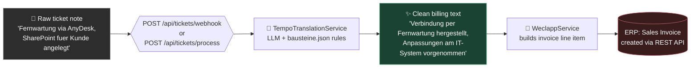

# 🎫 → 🤖 → 🧾 Ticket-to-Invoice AI Pipeline

**Turns a technician's raw ticket notes into clean, customer-facing billing
text via an LLM, then pushes it straight into an ERP as a sales invoice.**


> **This is a proof of concept extracted from a larger internal project.**
> Every credential, tenant ID, and internal hostname has been replaced with a
> placeholder — it won't run against any real system as-is, but every line
> of actual logic is intact so you can see exactly how the pipeline works.

---

## Why this exists

Technicians write ticket notes for themselves: internal jargon, tool names,
colleague names, half-sentences. Customers shouldn't see any of that on an
invoice. This service sits between "ticket closed" and "invoice sent" and
automates the translation:



The LLM step isn't a generic "summarize this" prompt — `bausteine.json`
defines a strict rule set the model must follow:

- **Filter logic** — internal-only chatter ("Rücksprache mit Kollege X") gets
  deleted entirely; anything customer-relevant survives.
- **Fixed phrase mapping** — a closed vocabulary of trigger → replacement
  pairs (e.g. *AnyDesk/VPN/remote* → "Verbindung per Fernwartung
  hergestellt"), so wording stays consistent invoice to invoice.
- **Hard bans** — no adjectives, no titles, no product/tool names, no
  internal IDs or first names.
- **Structured output** — the model is forced to reply with exactly
  `{"customer_billing_text": "..."}`, which the service parses directly.

---

## Pipeline at a glance

Both endpoints funnel into the exact same code path
(`processAndSync` in `JiraWebhookController`) — they only differ in *where
the ticket text comes from*.

| Step | Component | What happens |
|---|---|---|
| 1 | `JiraWebhookController` | Receives ticket text (from Jira or directly) |
| 2 | `TempoTranslationService` | Sends text + rule-based system prompt to the LLM, strips `<think>` blocks and stray markdown, parses the JSON reply |
| 3 | `WeclappService` | Converts hours + cleaned text into a Weclapp sales-invoice line item and POSTs it |

---

## 📡 API Reference

### `POST /api/tickets/webhook`

Registered as a Jira Automation/webhook target. Fires on issue updates;
only actually processes the issue once its status is `Done` / `FERTIG`.

**Flow:** reads the issue key + summary from the webhook payload → fetches
all worklogs for that issue via the Jira REST API → runs every worklog
comment through the pipeline → batches everything into one invoice sync.

<details>
<summary><strong>Request</strong> (sent by Jira, not hand-crafted)</summary>

```json
{
  "issue": {
    "key": "SUP-123",
    "fields": {
      "summary": "Mailbox migration for customer X",
      "status": { "name": "Done" }
    }
  }
}
```
</details>

<details>
<summary><strong>Response</strong></summary>

```json
{
  "processed_notes": [
    {
      "author": "Jane Doe",
      "time_spent": "1h 30m",
      "raw_text": "Telefonat mit Herrn Prof. Dr. Richter, SharePoint Site angelegt",
      "ai_cleaned_text": "Kommunikation mit Herrn Richter geführt, Anpassungen am IT-System vorgenommen"
    }
  ],
  "erp_sync": "triggered"
}
```
</details>

If the issue isn't Done yet, the response is just `{"status": "skipped"}`
and nothing is processed.

---

### `POST /api/tickets/process`

A plain REST endpoint that runs the same pipeline on ticket text you send
directly — no Jira involved. Useful for manual testing, or for plugging in
any other ticketing system without touching the pipeline itself.

**Request body:**

| Field | Type | Required | Default | Description |
|---|---|---|---|---|
| `ticketText` | string | ✅ | — | The raw technician note to clean up |
| `ticketKey` | string | ❌ | `"MANUAL-1"` | Reference shown on the invoice line |
| `ticketSummary` | string | ❌ | `""` | Short title shown on the invoice line |
| `author` | string | ❌ | `""` | Who wrote the note (informational only) |
| `timeSpent` | string | ❌ | `"1h"` | Duration in Jira-style format, e.g. `"2h 30m"` |

<details open>
<summary><strong>Example</strong></summary>

```bash
curl -X POST http://localhost:8080/api/tickets/process \
  -H "Content-Type: application/json" \
  -d '{
    "ticketKey": "SUP-456",
    "ticketSummary": "Onboarding new laptop",
    "author": "Jane Doe",
    "timeSpent": "45m",
    "ticketText": "Kurzes Telefonat mit Herrn Mueller, neues Notebook per AnyDesk eingerichtet, Test lief erfolgreich."
  }'
```

```json
{
  "processed_notes": [
    {
      "author": "Jane Doe",
      "time_spent": "45m",
      "raw_text": "Kurzes Telefonat mit Herrn Mueller, neues Notebook per AnyDesk eingerichtet, Test lief erfolgreich.",
      "ai_cleaned_text": "Kommunikation mit Herrn Mueller geführt, Verbindung per Fernwartung hergestellt, Funktionstest ausgeführt, Funktion OK"
    }
  ],
  "erp_sync": "triggered"
}
```
</details>

If `ticketText` is empty, the endpoint returns `400` with an `error` field.
If the AI returns no usable text (e.g. the note was purely internal
chatter), `erp_sync` is `"skipped"` and no invoice call is made.

---

## 🔧 Customization via `bausteine.json`

The entire "personality" and rule set of the AI step lives in **one JSON
file** (`src/main/resources/bausteine.json`) — not in Java code.
`TempoTranslationService` doesn't know any IT vocabulary, tone-of-voice
rules, or output format itself; at startup (`@PostConstruct`) it just reads
this file and mechanically assembles it into one system prompt, in this
fixed order:

| Key | Purpose |
|---|---|
| `identitaet` + `aufgabe` | Who the AI "is" and what its job is |
| `filter_logik` | What gets deleted entirely before anything is rewritten (e.g. purely internal chatter) |
| `bausteine` | The core: a closed list of `trigger` → `replacement` phrase pairs, e.g. *AnyDesk/VPN/remote* → "Verbindung per Fernwartung hergestellt". This is fixed vocabulary, not free paraphrasing — every technician's notes come out sounding consistent. |
| `strikte_verbote` | Hard bans (no adjectives, no titles, no product names, no internal IDs/first names) |
| `bedingter_abschluss` | Conditional rules, e.g. auto-appending "Funktionstest ausgeführt, Funktion OK" whenever a test is confirmed |
| `output_format` | Forces the model to reply with exactly `{"customer_billing_text": "..."}`, including a worked example (few-shot) |

Because all of this is data, not code, **anyone can reshape the AI's entire
behavior by editing the JSON — no Java changes needed**:

- New client, different standard phrasing? Add a `bausteine` entry, e.g.
  `{"trigger": "Backup / Sicherung", "replacement": "Datensicherung durchgeführt"}`.
- Different tone or language? Edit `identitaet` / `aufgabe`.
- An extra hard rule (e.g. never spell out customer names)? Add one line to
  `strikte_verbote`.
- A different output shape (e.g. an extra category field)? Adjust
  `output_format` — the Java side only ever parses `customer_billing_text`
  generically, so it doesn't need to change.

## ⚙️ Configuration

Nothing in this repo is a real credential — every value has a
`CHANGE_ME`-style placeholder default in `application.properties`,
overridable via environment variables:

| Env var | Purpose |
|---|---|
| `OLLAMA_BASE_URL` | Where the LLM runs (any Ollama-compatible endpoint) |
| `OLLAMA_MODEL` | Which model to use |
| `JIRA_DOMAIN` | Your Jira Cloud site URL |
| `JIRA_USER` | Jira account email for API auth |
| `JIRA_TOKEN` | Jira API token |
| `WECLAPP_URL` | Weclapp tenant API base URL |
| `WECLAPP_TOKEN` | Weclapp API auth token |
| `WECLAPP_CUSTOMER_ID` | Customer the invoice gets billed to |
| `WECLAPP_UNIT_ID` | Unit of measure (e.g. "hour") |
| `WECLAPP_TAX_ID` | Tax rate to apply |
| `WECLAPP_ARTICLE_ID` | Billable article/service line |
| `WECLAPP_UNIT_PRICE` | Hourly rate |

## ▶️ Running locally

```bash
./mvnw spring-boot:run
```

Without a real Ollama instance and Jira/Weclapp accounts configured, you can
still exercise `POST /api/tickets/process` to see the AI abstraction step
in isolation — the Weclapp call will simply log an error with the
placeholder credentials rather than sending anything anywhere.
